# Power (kW) for demand charge correlation

These 4 meters have power (kW) correlated each other for the past 3 years. The correlations are various depending upon the comparisons. In general, power in `PQ` meter is mostly correlated with power in `Wat3`. This founding is interesting as the more correlated, the more dependency resulting in less effective to address load reduction of having a virtual meter, are expected. 

<!-- -->

# Past 3 years power trends of each meter (Nov. 2017 to Apr. 2019)

Variances of power (kW) for each meter, verify the correlations found in the previous correlation plot.

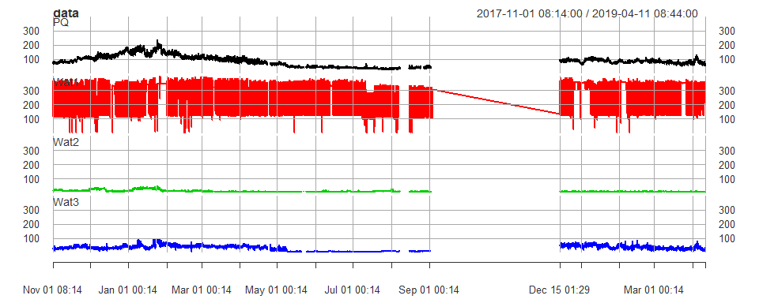<!-- -->

A regression model for power of `PQ` shows `Wat3` is the most significant followed by `Wat2` resulting in 0.72 in adjusted R-squared. They are higly correlated. 

<table class="table table-striped table-hover table-condensed" style="margin-left: auto; margin-right: auto;">
<caption>PQ power (kW) regression in Wat1, Wat2 and Wat3</caption>
 <thead>
  <tr>
   <th style="text-align:left;"> term </th>
   <th style="text-align:right;"> estimate </th>
   <th style="text-align:right;"> std.error </th>
   <th style="text-align:right;"> statistic </th>
   <th style="text-align:right;"> p.value </th>
  </tr>
 </thead>
<tbody>
  <tr>
   <td style="text-align:left;"> (Intercept) </td>
   <td style="text-align:right;"> 15.73 </td>
   <td style="text-align:right;"> 0.38 </td>
   <td style="text-align:right;"> 41.94 </td>
   <td style="text-align:right;"> 0 </td>
  </tr>
  <tr>
   <td style="text-align:left;"> Wat1 </td>
   <td style="text-align:right;"> 0.00 </td>
   <td style="text-align:right;"> 0.00 </td>
   <td style="text-align:right;"> 3.37 </td>
   <td style="text-align:right;"> 0 </td>
  </tr>
  <tr>
   <td style="text-align:left;"> Wat2 </td>
   <td style="text-align:right;"> 2.02 </td>
   <td style="text-align:right;"> 0.02 </td>
   <td style="text-align:right;"> 131.52 </td>
   <td style="text-align:right;"> 0 </td>
  </tr>
  <tr>
   <td style="text-align:left;"> Wat3 </td>
   <td style="text-align:right;"> 1.34 </td>
   <td style="text-align:right;"> 0.01 </td>
   <td style="text-align:right;"> 231.90 </td>
   <td style="text-align:right;"> 0 </td>
  </tr>
</tbody>
</table>

# Forecast based on month

Using ARIMA, power trends of each meter were forecasted based on month, which is the billing cycle for demand charge. The power trends were plotted with maximum value of the peack power during the month because the peak power decides the billing cost. 

## PQ

It was expected that power for PQ would be around 125 kW for the last 3 months and the real values for these months were 114, 107, and 131 kW respectively. 

### Montly maximum peak power(kW) trend

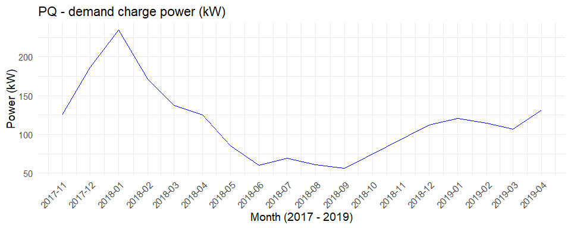<!-- -->

### Density of maximum peak power (kW)

The density plot shows the distribution of the monthly peak power for each meter. For `PQ`, peak power around 125 kW is mostly prevalent, which means there is more probability that `PQ` peak power would be around 125 kW. 

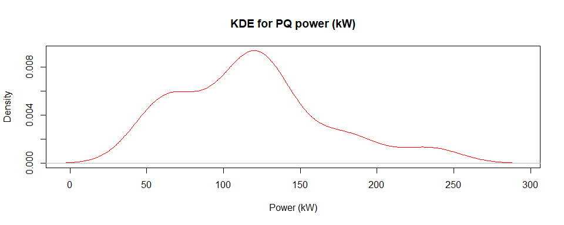<!-- -->

### Prediction performance for the last 3 months

ARIMA predicted the peak power for the last 3 months, which is February, March, and April given the previous peak power data from November, 2017 to January, 2019. Since there are 2 months missing (November and December of 2018), the months used for the prediction were 13 months. Given the historical data of 13 months, the model predicts the coming 3 months and it is quite accurate as around 125 kW compared to the real values for these months, 114, 107, and 131 kW respectively. 

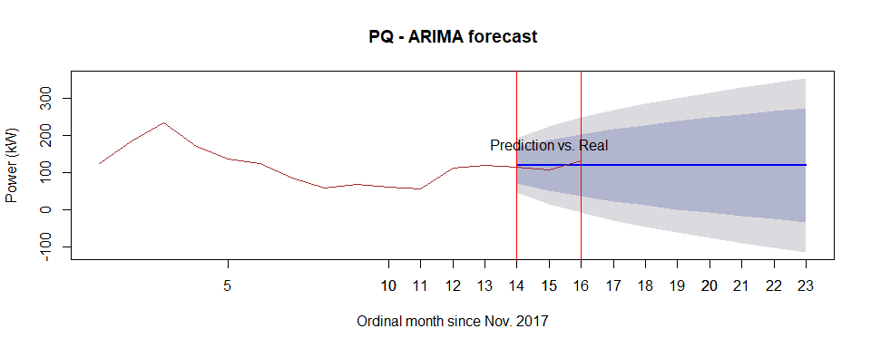<!-- -->

## Wat1

It was expected that power for Wat1 would be around 372 kW for the last 3 months and the real values for these months were 385, 377, and 370 kW respectively. 

### Montly maximum peak power(kW) trend

<!-- -->

### Density of maximum peak power (kW)

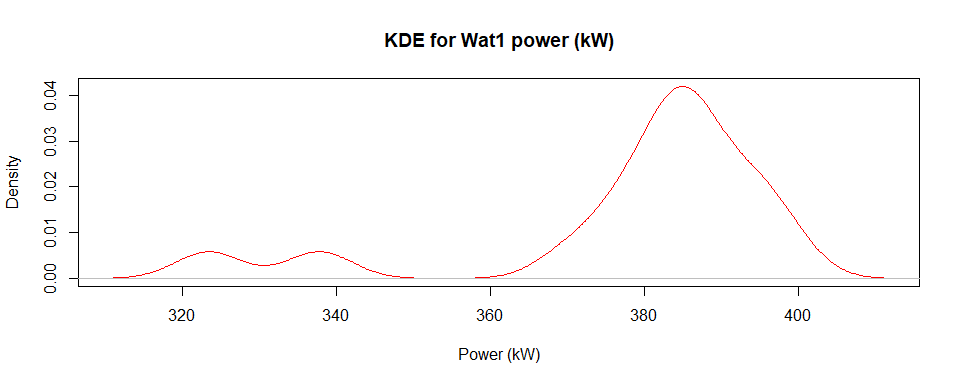<!-- -->

### Prediction performance for the last 3 months

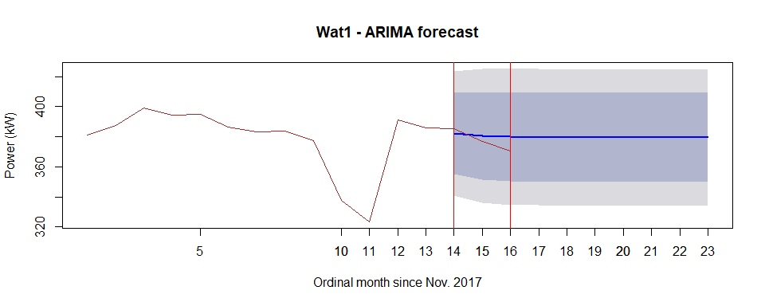<!-- -->

## Wat2

It was expected that power for Wat2 would be around 18 kW for the last 3 months and the real values for these months were 20, 19, and 17 kW respectively. 

### Montly maximum peak power(kW) trend

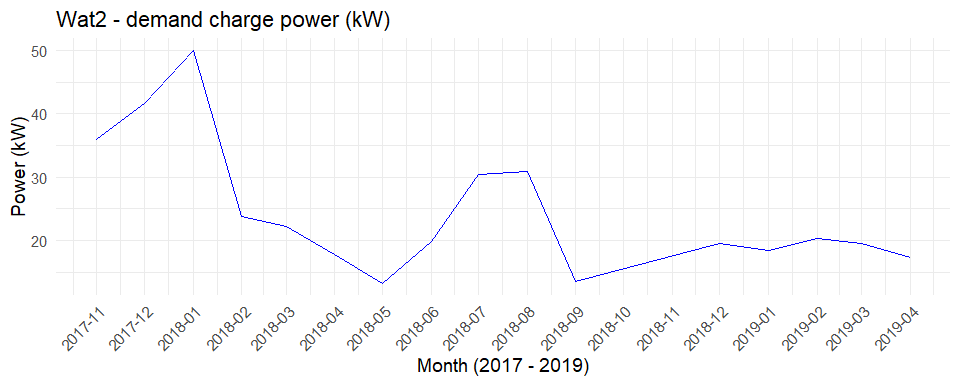<!-- -->

### Density of maximum peak power (kW)

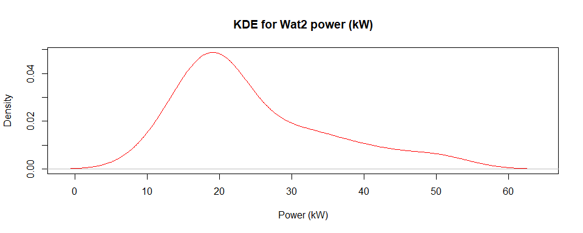<!-- -->

### Prediction performance for the last 3 months

<!-- -->

## Wat3

It was expected that power for Wat3 would be around 68 kW for the last 3 months and the real values for these months were 89, 52, and 85 kW respectively. 

### Montly maximum peak power(kW) trend

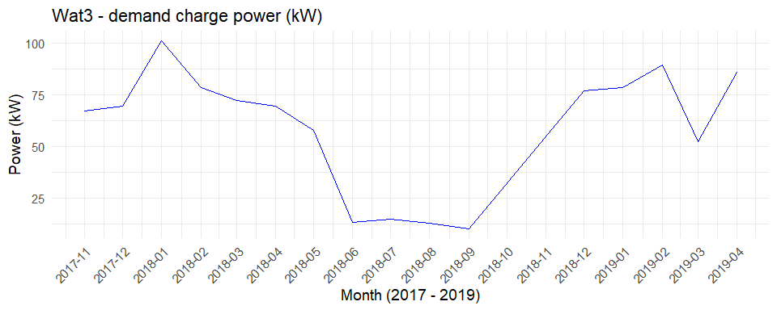<!-- -->

### Density of maximum peak power (kW)

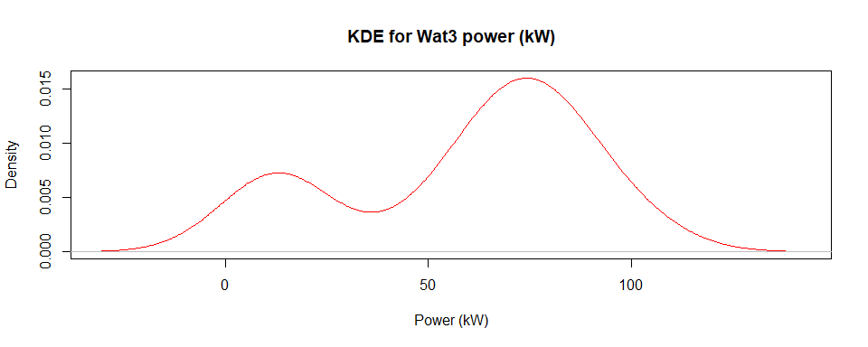<!-- -->

### Prediction performance for the last 3 months

<!-- -->

# Forecast based on day

For the comparison, forecastes based on day, were also plotted. The range between the upper and lower bound of forecast shows narrower than the one based on month. 

## PQ

### Daily maximum peak power(kW) trend

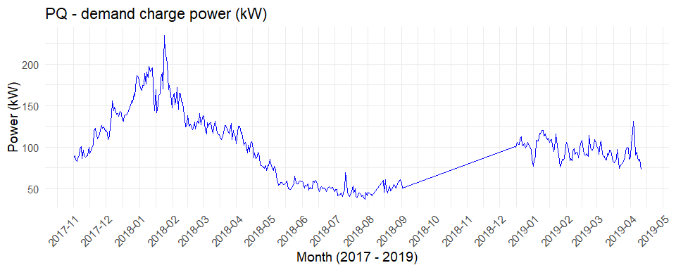<!-- -->

### Density of maximum peak power (kW)

<!-- -->

### Prediction performance for the last 10 days

There are total 413 days previously available since November 2017 till April 2019. Given the 404 days, rest of 10 days were predicted from 405th day to 413th day as below in the figure. 

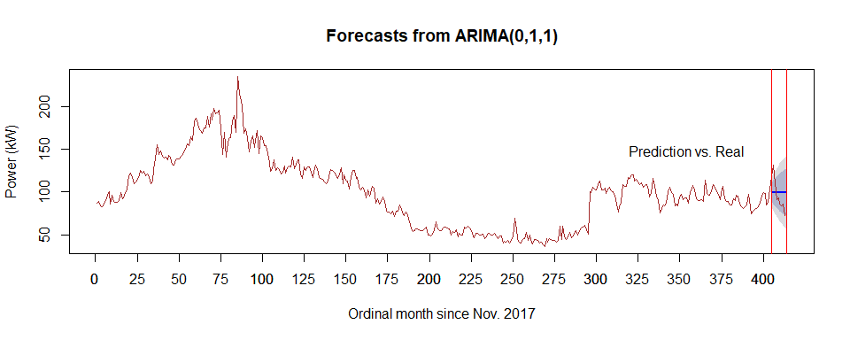<!-- -->

## Wat1

### Daily maximum peak power(kW) trend

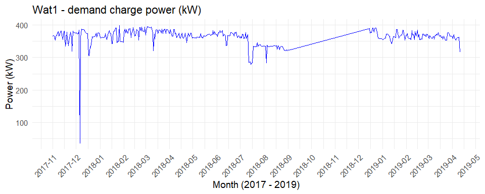<!-- -->

### Density of maximum peak power (kW)

<!-- -->

### Prediction performance for the last 10 days

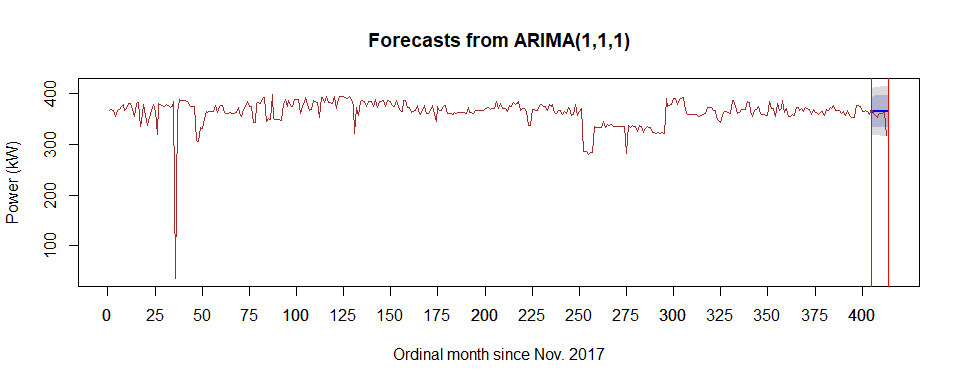<!-- -->

## Wat2

### Daily maximum peak power(kW) trend

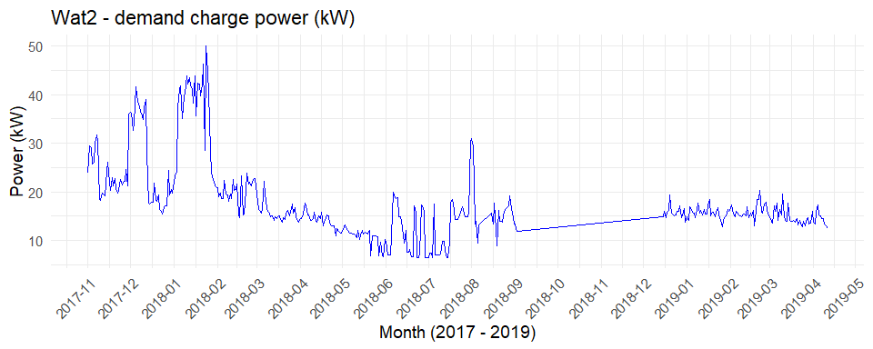<!-- -->

### Density of maximum peak power (kW)

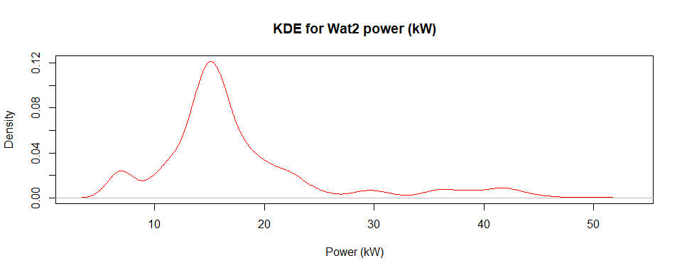<!-- -->

### Prediction performance for the last 10 days

<!-- -->

## Wat3

### Daily maximum peak power(kW) trend

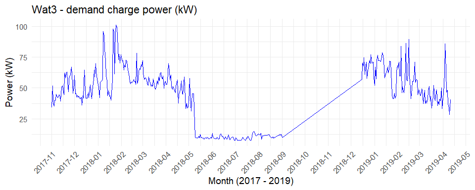<!-- -->

### Density of maximum peak power (kW)

<!-- -->

### Prediction performance for the last 10 days

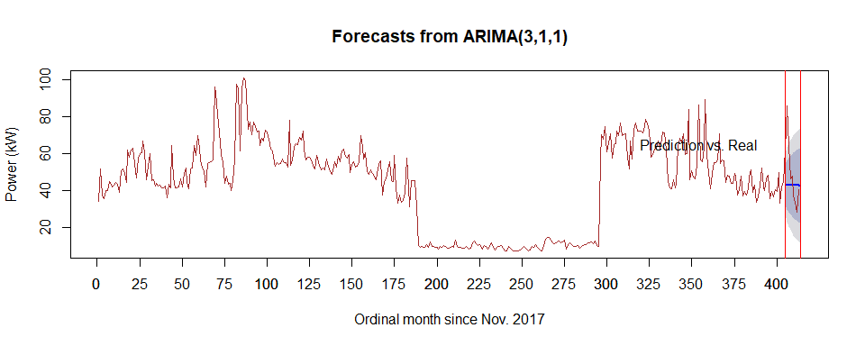<!-- -->
